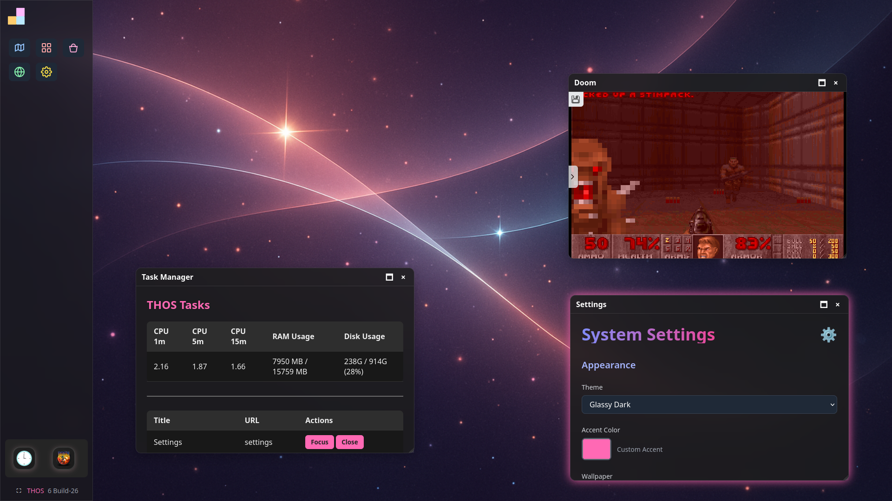
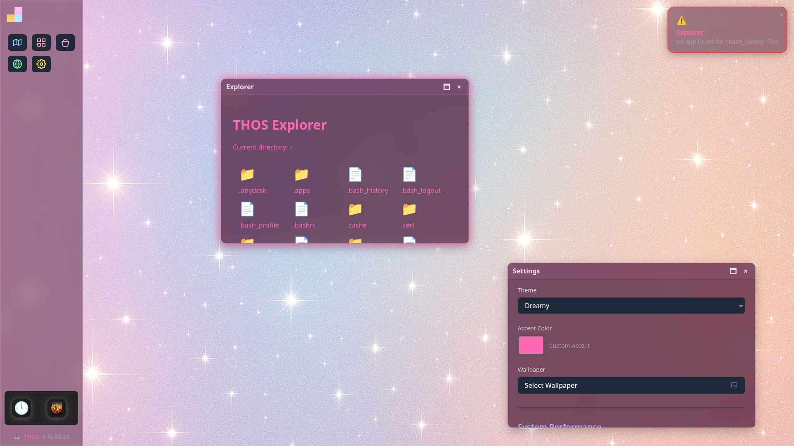
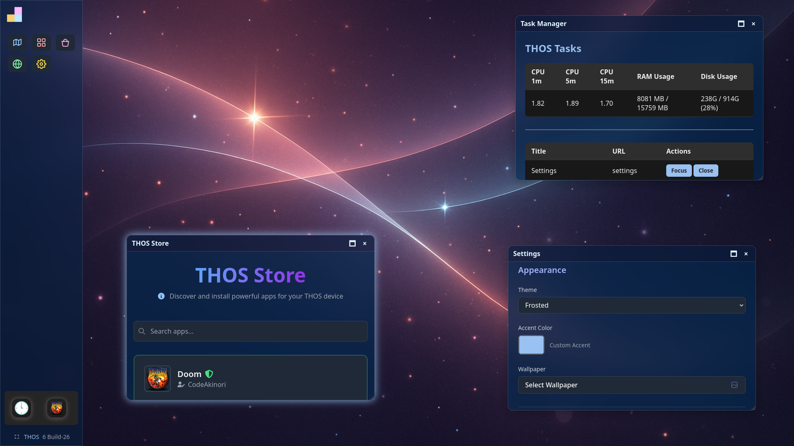
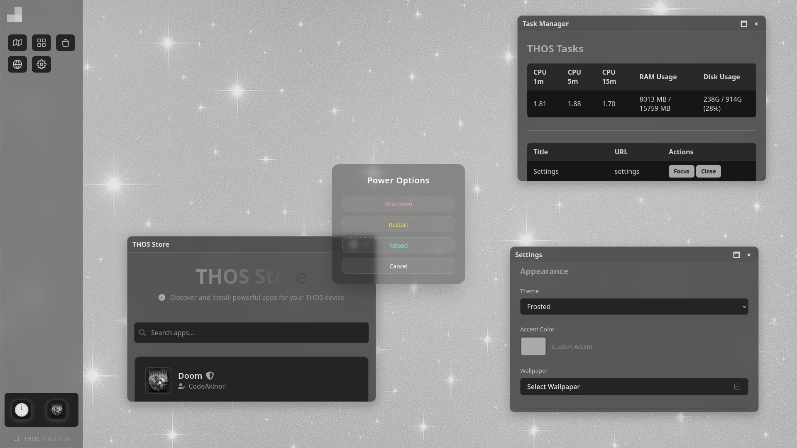

# THOS Server

**THOS Server** is the open source backend server for the [THOS Operating System](https://surillya.com/thos), a premium kiosk-style Linux distribution. It handles the whole server, like session persistence, OOBE (Out-of-Box Experience), and local app installer for the THOS ecosystem.

---


## Features

- Local PHP server for kiosk-mode environments
- Persistent session and configuration data (beyond cookies/localStorage)
- Built to run smoothly in Chromium or Firefox kiosk mode under Arch or similar

## 📸 Screenshots

   

## ⚙️ Setup Instructions

1. Clone the repo:

   ```bash
   git clone https://tea.surillya.com/Surillyacom/THOS-Server.git
   cd THOS-Server
   ```

2. Install dependencies:

   ```bash
   sudo pacman -S php
   ```

3. Launch local server (as sudo):

   ```bash
   sudo php -S 0.0.0.0:80
   ```

4. Access it in your browser: [http://localhost](http://localhost)

## 🔒 Security

The server runs per default as sudo, since it's intended to run server-side commands. This may lead to security issues, so don't just expose it to the web, or give anyone access! And watch out for what apps you install - we recommend only installing *verified* apps from the official THOS store!

## 🧠 Behind the Scenes

THOS is designed to run on a minimalistic Linux distro with kiosk capabilities. It ties together:

* Firefox in kiosk mode
* Local server logic for user interaction
* Persistent configuration for headless reboots

## 📄 License

This project is licensed under the **Apache 2.0 License**. See the [LICENSE](LICENSE) file for details.

---

## 🫶 Credits

THOS Server is a project by [Surillyacom Entertainment](https://surillya.com/), powered by hours of work and caffeine!